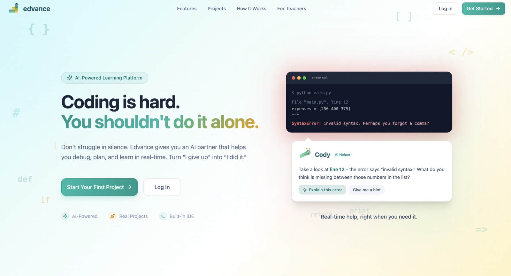
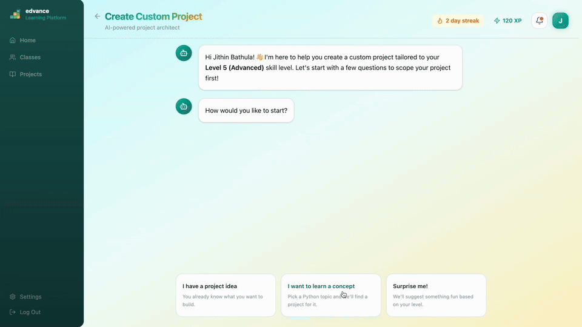
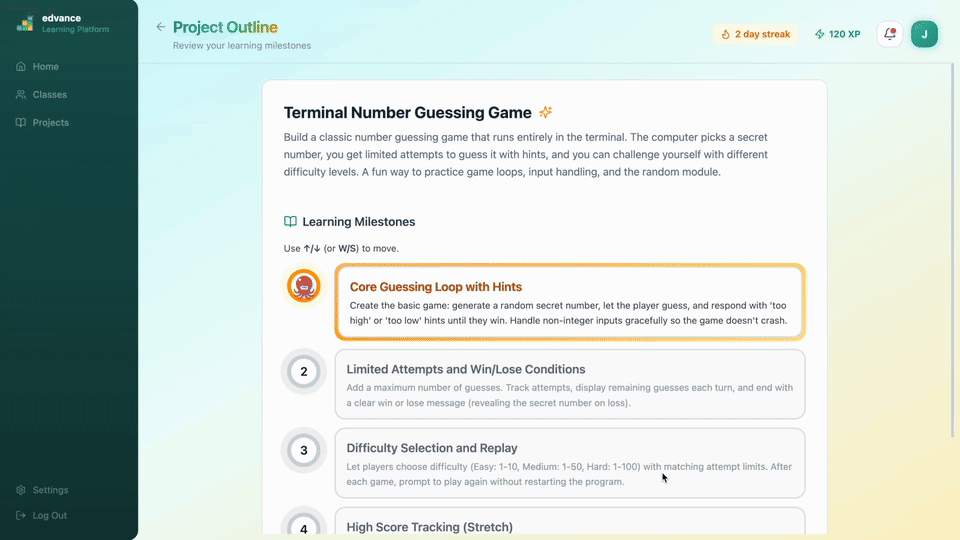
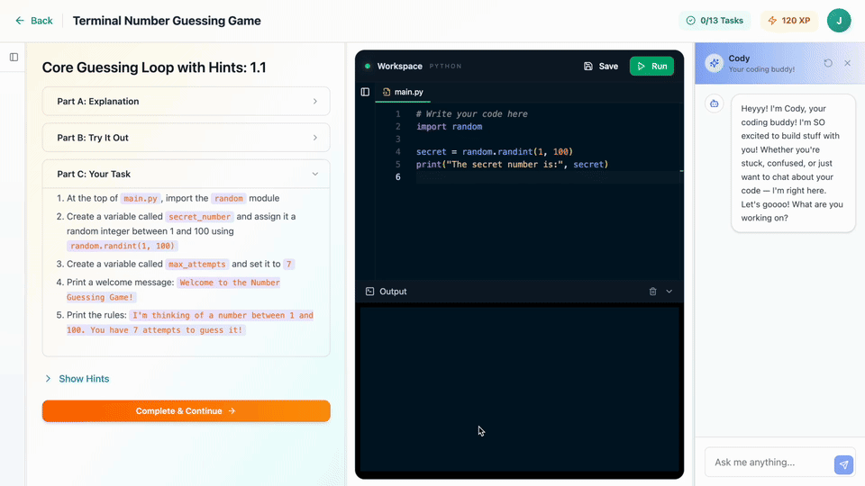
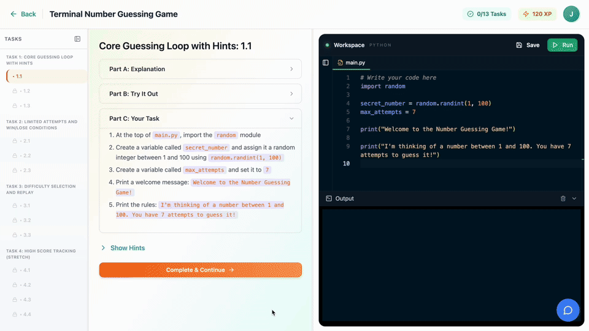
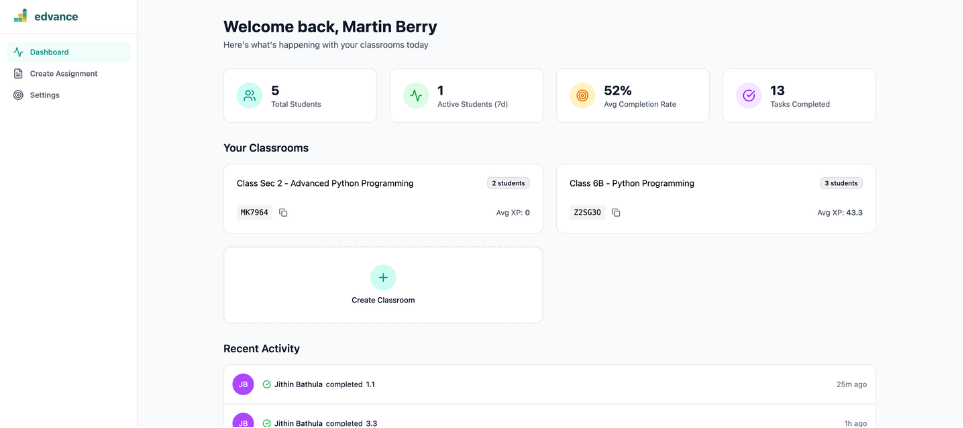
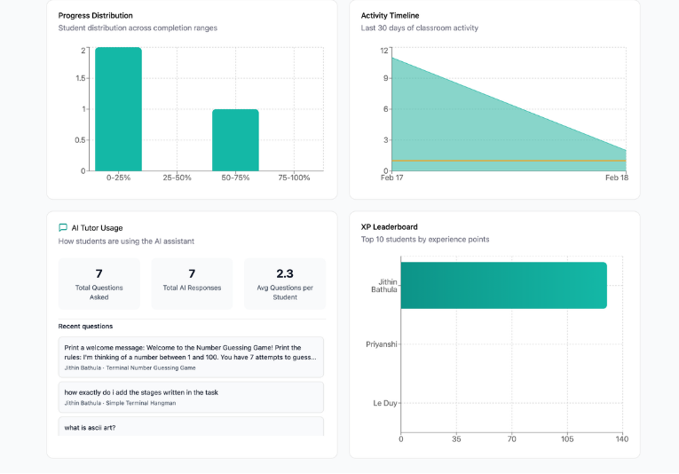

# Edvance

Edvance is an AI-powered platform for learning programming by building real projects. A student describes what they want to build, an AI agent turns that into a milestone-based curriculum, and the student writes and runs code directly in the browser while an AI tutor reviews each submission. Teachers can create classrooms, assign projects, and track progress.

The repo contains a React frontend, a Flask backend, and a small standalone waitlist site.

<p align="center">
  
</p>

## How it works

**1. Describe your project.** A student chats with a requirements agent (GPT 5.2 via OpenRouter) that helps them scope the idea, runs a quality check, and hands off when it is ready.



**2. Let AI plan it.** A planning agent (Claude Opus 4.5) generates an outline, then milestones of tasks. The first milestone comes back immediately and the rest are generated in a background thread.



**3. Code with AI guidance.** The workspace uses a Monaco editor and runs Python in a Pyodide web worker, so there is nothing to install. Cody, a tutoring agent, gives hints that don't give away the solution. Project files are stored in Supabase Storage.



**4. Submit and level up.** Submissions run against hidden test cases, then a Claude Sonnet 4 agent evaluates the code and returns feedback. Students earn XP, and a concept tracker records which skills they have shown.



**Teacher tools.** Teachers manage classrooms with join codes, create assignments from template projects, and see per-student analytics.

<table>
  <tr>
    <td></td>
    <td></td>
  </tr>
</table>

Student projects that use an LLM call a built-in proxy that forwards to Gemini, so students never need their own API keys.

## Tech stack

| Layer | Technology |
|---|---|
| Frontend | React 18, TypeScript, Vite, Tailwind CSS 4, Radix UI, Monaco, Pyodide, Framer Motion |
| Backend | Python 3.11+, Flask 3, Pydantic, OpenAI SDK pointed at OpenRouter |
| Auth and data | Supabase (Auth, Postgres, Storage) |
| Models | GPT 5.2, Claude Opus 4.5, Claude Sonnet 4 via OpenRouter; Gemini for the student proxy |

## Repository layout

```
frontend/   React app (students, teachers, landing page)
backend/    Flask API, AI agents, prompts, database schema, tests
waitlist/   Standalone waitlist landing page (separate Vite app)
.github/    CI and deploy workflows
```

Documentation lives in [`docs/`](docs/README.md): getting started, architecture, environment variables, database, frontend, deployment, testing, security and troubleshooting. Backend internals (agents, API reference) are under [`backend/docs/`](backend/docs/).

## Getting started

### Prerequisites

- Node.js 20+
- Python 3.11+
- A Supabase project. Run [`backend/db/schema.sql`](backend/db/schema.sql) in the SQL editor and create two storage buckets, `code-repos` (private) and `avatars` (public). See [docs/getting-started.md](docs/getting-started.md).
- An [OpenRouter](https://openrouter.ai) API key
- Optionally a Gemini API key, for the student AI proxy

### Backend

```bash
cd backend
python -m venv .venv && source .venv/bin/activate
pip install -r requirements.txt
cp .env.example .env        # fill in your keys
python app.py               # http://localhost:8000
```

### Frontend

```bash
cd frontend
npm install
cp .env.example .env        # point at the backend and your Supabase project
npm run dev                 # http://localhost:3000
```

### Docker

```bash
cp .env.example .env        # VITE_* values for the frontend build
cp backend/.env.example backend/.env
docker compose up --build
```

## Tests

```bash
cd backend && pytest
cd frontend && npm test
```

Both suites run in GitHub Actions on every pull request.

## Deployment

The backend ships as a Docker image (`backend/Dockerfile`). `backend/apprunner.yaml` and `backend/Procfile` cover AWS App Runner and Procfile-based hosts. The frontend and waitlist are built with AWS Amplify using `amplify.yml`.

## License

[MIT](LICENSE)
